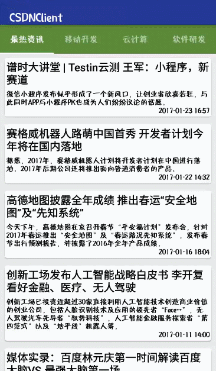
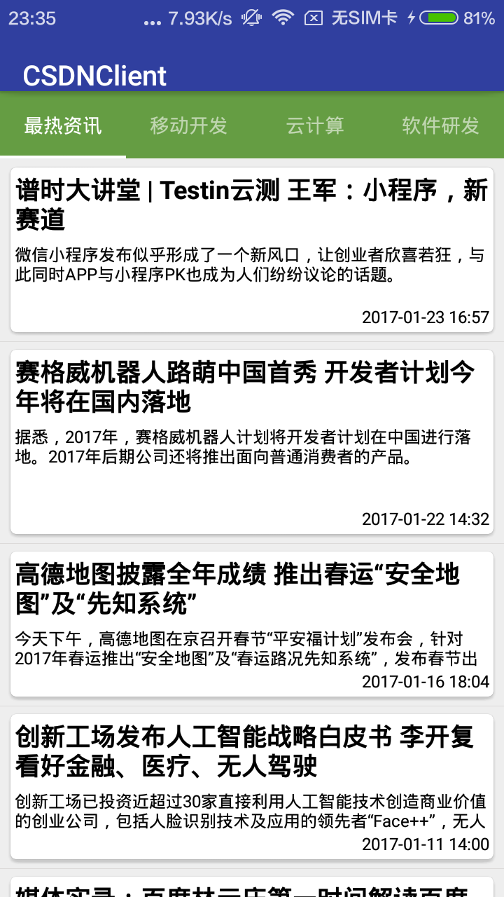
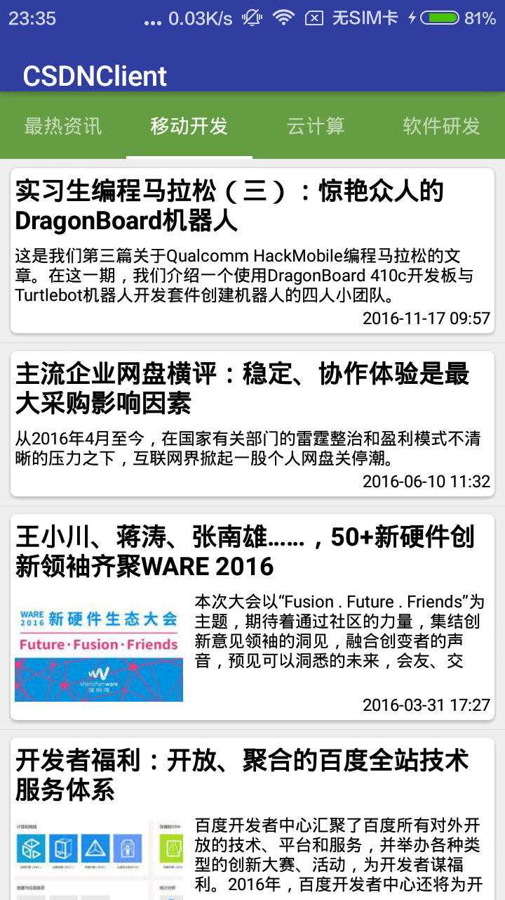
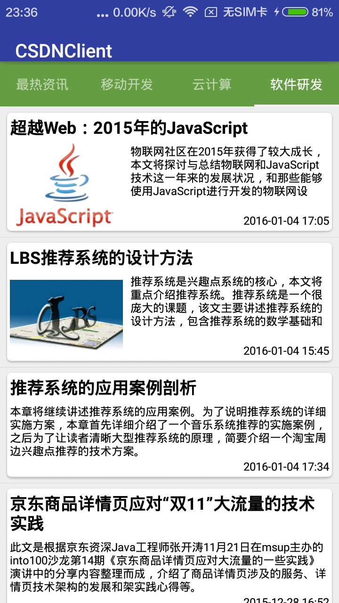

# CSDNClient

This is a reading news app. you can read Four modules that datas from CSDN.The project is updating, welcome to Star and Fork.
In addition,I think this project is very suitable for beginners.

# Libraries
com.android.support:design:24.2.1

com.android.support:appcompat-v7:24.2.1

com.android.support:recyclerview-v7:24.2.1

com.github.bumptech.glide:glide:3.7.0

org.jsoup:jsoup:1.9.2

com.android.support:cardview-v7:24.2.1

## Screenshots

##About me
I am a student in China, I love reading novel, love music. 
At the same time, I am also obsessed with writing code.
If you have any new idea about this project,welcome to [contact me](mailto:veyron_gz@163.com). :smiley:

In addition, my blog: [http://blog.csdn.net/leaf_130](http://blog.csdn.net/leaf_130)

##LICENSE

